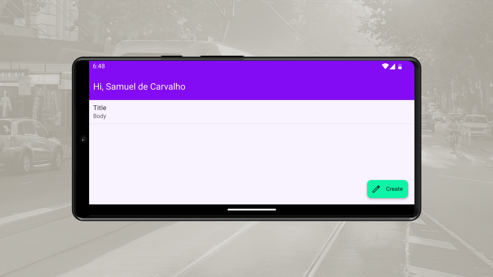

<h1 align="center">
Notes App With Jetpack Compose, Kotlin, Material 3, JUnit, Mockito, Coroutines, Room DAO, Retrofit, Espresso
</h1>

 

 

  <a href="#description">✍️ Description</a> &nbsp;&nbsp;&nbsp;|&nbsp;&nbsp;&nbsp <a href="#technologies">🚀 Technologies</a>

 
 

<h3 id="description">✍️ Description:</h3>

This port from the Android Xml layout to Jetpack Compose had some difficulties, for example translate the fragment context to the section context as an adaptation, so the screen declarations is not that long; and that is when Jetpack Compose come to play: it is a might user interface declaration library.

 

<h3 id="technologies">🚀 Technologies:</h3>

To build this project is used:

- Jetpack Compose
- Kotlin
- JUnit
- Compose Testing Library
- Mockito
- View Model
- Retrofit
- Room
- Coroutines
- Robolectric
- Mock Web Server

